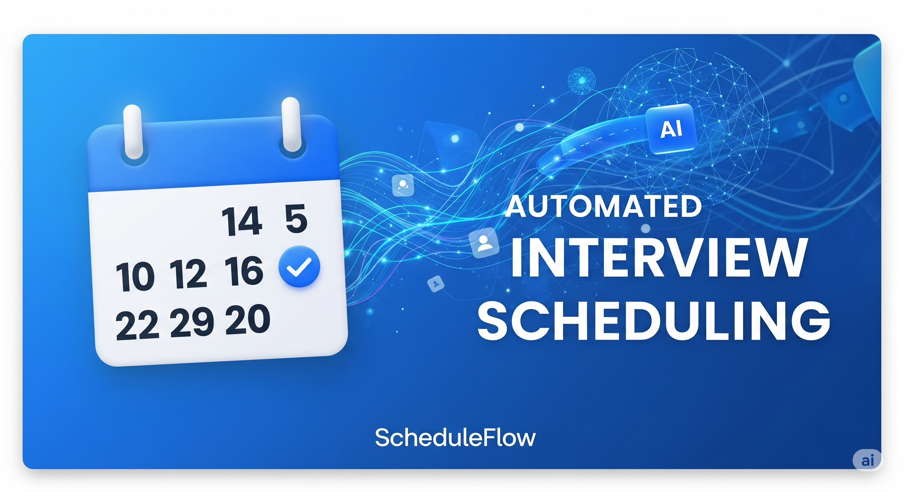

# ScheduleFlow: Interview Booking Automation

Welcome to **ScheduleFlow**, your friendly and efficient solution for automating interview scheduling! Built with love using n8n, Render, and a touch of AI magic, ScheduleFlow streamlines the process of booking interviews by connecting users with your calendar, sending confirmation emails, and handling all the details seamlessly.
=>[Test it Here](https://rb.gy/441v4s)
## 🎥 Demo: See ScheduleFlow in Action!

Before you dive in, watch this 2-minute demo to see how ScheduleFlow works from a candidate's perspective, from starting a chat to getting a confirmed booking in your calendar.

[](https://youtu.be/_5RHeS6pPqk)

> **[Click here to watch the full demo on YouTube](https://youtu.be/_5RHeS6pPqk)**

## ✨ What is ScheduleFlow?

ScheduleFlow is an end-to-end interview booking automation tool that allows candidates to book meetings with you directly through a sleek web interface. Powered by a conversational AI, it checks your availability, books the slot, and sends you an email with the booking details—all without the back-and-forth hassle. It’s perfect for managing interview schedules efficiently and professionally.

##  Features

- **Conversational AI Booking**: Chat with an AI (named Nathan!) to schedule interviews.
- **Real-Time Calendar Integration**: Checks your Google Calendar for availability and books slots automatically.
- **Email Notifications**: Receive detailed emails with meeting details, including the candidate's reason for the interview.
- **Dark-Mode Interface**: A modern, animated, and user-friendly frontend.
- **24/7 Availability**: Deployed on Render's free tier with a keep-alive mechanism.
- **Open-Source Backbone**: Built with n8n for flexible workflow automation.

## 🛠 How It Works

### Step-by-Step Flow
1. **User Interaction**: A candidate visits the ScheduleFlow website and clicks "Book Meeting."
2. **AI Chat Activation**: The page transitions to a chat interface where Nathan, the AI assistant, greets them and asks for details (e.g., email, preferred time, reason for the interview).
3. **Backend Processing**: The n8n backend processes the request, checks your Google Calendar for available slots, and books the meeting if a suitable time is found.
4. **Email Confirmation**: You receive an email with the booking details, including the candidate's information and reason.
5. **Response to User**: The AI confirms the booking with the candidate via chat.

### Technology Stack
- **Frontend**: HTML, CSS, and the `@n8n/chat` library for the chat interface.
- **Backend**: n8n for workflow automation, integrated with Google Calendar and Gmail APIs.
- **Deployment**: Render (free tier) for hosting both frontend and backend.
- **AI**: OpenAI (GPT-4o) for conversational capabilities (customizable to Grok via xAI API).

## 📋 Getting Started

### Prerequisites
- A Render account (free tier at [render.com](https://render.com)).
- A Google account for Calendar and Gmail integration.
- An OpenAI API key (free trial available at [platform.openai.com](https://platform.openai.com)).
- Git and a code editor (e.g., VS Code).

### Installation

1. **Clone the Repository**
   ```bash
   git clone [https://github.com/yourusername/scheduleflow.git](https://github.com/Genious07/ScheduleFlow.git)
   cd scheduleflow
   ```

2. **Set Up the Backend**
   - Deploy the n8n backend using the [n8n-ai-render template](https://github.com/piloterr/n8n-ai-render).
   - Fork the repo, click "Deploy to Render," and follow the setup wizard.
   - Configure environment variables in Render (e.g., `N8N_CORS_ORIGIN=https://your-site.onrender.com`).
   - Set up Google OAuth credentials and OpenAI API key in n8n.

3. **Configure the Workflow**
   - Import the interview scheduling workflow into n8n 
   - Update placeholders (e.g., your email, time zone) and enable streaming in the "Candidate Chat" and "AI Agent" nodes.

## 🖥 Deployment

- **Backend**: Deployed on Render as a web service with a free PostgreSQL database (90-day free trial, then $7/month).
- **Frontend**: Hosted as a static site on Render’s free tier (750 hours/month, always available).
- **Keep Alive**: Uses a scheduled ping to prevent sleep on the free tier.

## 🤝 Contributing

We’d love your help to make ScheduleFlow even better! Feel free to:
- Report bugs or suggest features by opening an issue.
- Fork the repo, make changes, and submit a pull request.
- Share your ideas .

## 📜 License

This project is open-source under the MIT License. See the [LICENSE](LICENSE) file for details.

## 🙌 Acknowledgments

- Inspired by the need for simpler interview scheduling.
- Special shoutout to Render for free hosting!

## 📞 Contact

Have questions or need support? Reach out at [satwiks788@gmail.com](mailto:satwiks788@gmail.com).

Happy scheduling with ScheduleFlow! 🚀
